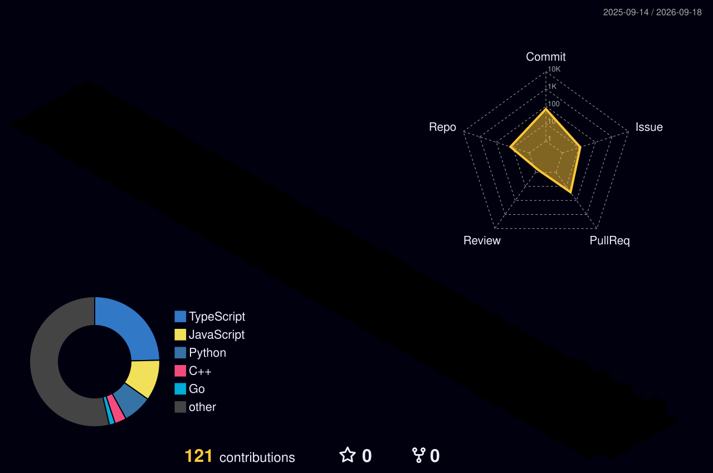

<!-- =========================================================
     HEADER SECTION
     ========================================================= -->

  
  
  

 

 

 

<!-- =========================================================
     ABOUT ME 
     ========================================================= -->
## 👨‍💻 About Me

Hello! I'm Ricky, a passionate developer studying Computer Science at **IIIT Gwalior**. I love building scalable applications, designing backend systems, and solving complex algorithmic problems. 

- 🎓 **Education:** B.Tech CSE — IIIT Gwalior
- 💻 **Focus:** Full Stack Web Development & Backend Engineering
- 🚀 **Core Tech:** React, Node.js, Express, TypeScript
- 🧩 **Problem Solving:** 800+ DSA Problems Solved
- 🏆 **Competitive Coding:** Codeforces Pupil (1348) | ⭐ LeetCode 1800+
- 🌱 **Currently Learning:** System Design, Microservices, Database Optimization
- 🤝 **Open For:** Open Source Collaborations & Developer Tooling

 

**My Engineering Style:**  

  

<!-- =========================================================
     ACHIEVEMENTS
     ========================================================= -->
## 🏆 Achievements

  
  
  
  
    
  <i>🏆 Top 100 in a national-level IEEE hackathon among 3000+ teams</i>

 

<!-- =========================================================
     TECH STACK (Categorized Layout)
     ========================================================= -->
## 🧠 My Skills

**Programming Languages** 

  

**Frontend & Full Stack** 

  

**Backend & Databases** 

  

**IDE, Tools & Version Control** 

  

<!-- =========================================================
     FEATURED PROJECTS
     ========================================================= -->
## 🚀 Featured Projects

<table>
  <tr>
    <td width="50%" valign="top">
      <h3>🔄 LeetCode → GitHub Sync</h3>
      

        
        
      

      
Automatically syncs accepted LeetCode submissions to GitHub with metadata enrichment and structured Markdown notes.

      
    </td>
    <td width="50%" valign="top">
      <h3>🤖 Student Docs + AI Assistant</h3>
      

        
        
      

      
AI-powered document assistant that lets users upload PDFs and ask context-aware questions using the Gemini API.

      
    </td>
  </tr>
  <tr>
    <td width="50%" valign="top">
      <h3>🚗 Parkade — SmartPark</h3>
      

        
        
      

      
Parking slot booking platform with JWT authentication, MySQL-backed reservations, and a responsive Tailwind frontend.

      
    </td>
    <td width="50%" valign="top">
      <h3>📂 Explore More</h3>
      

        
      

      
Explore my other repositories containing full-stack apps, developer tools, chrome extensions, and experiments.

      
    </td>
  </tr>
</table>

<!-- =========================================================
     GITHUB ANALYTICS
     ========================================================= -->
## 📊 GitHub Analytics

  
  

 

  
    
  
  
  

